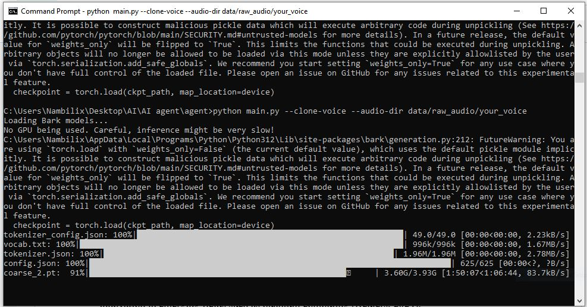

# VoiceCloning AI Agent 🎤🤖



**VoiceCloning-AI** is developed by [Science Techniz](https://www.sciencetechniz.com/), a research AI startup. This is a comprehensive Python project that allows you to clone your own voice and integrate it with AI agents ([Grok](https://grok.com/), OpenAI) for natural, dynamic, and intelligent conversations. Voice cloning is the process of synthesizing speech that replicates the tone, pitch, and speaking style of a specific person. Modern voice cloning systems leverage deep learning models trained on vast amounts of audio data to capture the unique acoustic and linguistic patterns that define an individual’s voice. Two key technologies that enable this are [HuBERT (Hidden-Unit BERT)](https://huggingface.co/docs/transformers/en/model_doc/hubert) and [BARK](https://huggingface.co/suno).

HuBERT is a self-supervised speech representation model developed by Meta AI. It converts raw audio into discrete “speech units” that capture the underlying phonetic and linguistic content without requiring labeled data. In a voice cloning pipeline, HuBERT acts as a feature extractor, breaking down an existing voice sample into meaningful speech representations. These units encode how a person articulates words, including rhythm, pronunciation, and tone.

BARK, developed by [Suno AI](https://suno.com/home), is a text-to-audio generation model that can produce highly realistic speech and even nonverbal sounds like laughter or breathing. Once a voice’s characteristics have been captured (e.g., via HuBERT or another embedding model), BARK can use this information to generate new audio that mimics the speaker’s voice from any input text. In essence, HuBERT provides the content representation, while BARK provides the generative synthesis.

Together, HuBERT and BARK form a powerful framework for voice cloning. By first analyzing and encoding the vocal features of a reference sample and then using a generative model to recreate them, these systems can produce natural, expressive, and personalized speech outputs—allowing users to “clone” a voice for applications such as virtual assistants, dubbing, or personalized media content.


---

## ✨ Features

- 🎤 **Voice Cloning** — Clone your voice using Bark AI  
- 🤖 **AI Integration** — Supports Grok and OpenAI APIs  
- 🗣️ **Real-Time Conversations** — Voice-activated AI assistant  
- ⚡ **Multiple Modes** — Wake word, interactive, and voice-only modes  
- 🔧 **Customizable** — Easy configuration and setup  

---

## 🚀 Quick Start

### Prerequisites
- Python 3.8+
- 8GB+ RAM (16GB recommended)
- 10GB+ free storage for models
- Microphone and speakers

---

### Installation

```bash
git clone https://github.com/nambili-samuel/VoiceCloning-AI.git
cd VoiceCloning-AI
pip install -r requirements.txt
python setup_project.py
```

---

## 🗣️ Basic Usage

### Record your voice
```bash
python record_voice.py
```

### Clone your voice
```bash
python main.py --clone-voice --audio-dir data/raw_audio/your_voice --speaker-name your_voice
```

### Run the AI agent
```bash
python main.py --run-agent
```

---

## 📁 Project Structure

```
VoiceCloning-AI/
├── config/
│   ├── settings.py
│   ├── api_keys.py
│   └── __init__.py
├── data/
│   ├── raw_audio/
│   ├── processed_audio/
│   └── models/
├── src/
│   ├── voice_cloning.py
│   ├── ai_agent.py
│   ├── grok_client.py
│   ├── tts_engine.py
│   ├── audio_processing.py
│   └── __init__.py
├── examples/
│   ├── run_agent.py
│   ├── clone_voice.py
│   └── __init__.py
├── training/
│   ├── train_voice_clone.py
│   └── __init__.py
├── main.py
├── requirements.txt
└── README.md
```

---

## 🔧 Configuration

### API Keys Setup

Create a file `config/api_keys.py`:

```python
# Get your Grok API key from https://api.x.ai/
GROK_API_KEY = "your_grok_api_key_here"

# Optional: OpenAI API key
OPENAI_API_KEY = "your_openai_key_here"
```

Alternatively, set them as environment variables:
```bash
# Windows
set GROK_API_KEY=your_key_here
set OPENAI_API_KEY=your_key_here

# macOS/Linux
export GROK_API_KEY=your_key_here
export OPENAI_API_KEY=your_key_here
```

---

## 🎧 Voice Recording Guide

- **Format**: WAV (uncompressed)  
- **Sample Rate**: 22050 Hz  
- **Channels**: Mono  
- **Duration**: 5–10 minutes total  
- **Environment**: Quiet room, minimal background noise  

### Record using the built-in recorder:
```bash
python record_voice.py
```

Place your recordings under:
```
data/raw_audio/your_voice/
```

---

## 🧠 Usage Examples

### Voice Cloning
```bash
python main.py --clone-voice --audio-dir data/raw_audio/your_voice
python main.py --test-voice --speaker-name your_voice
```

### Full AI Agent
```bash
python main.py --run-agent
python main.py --run-agent --speaker-name your_voice
```

### Command-Line Options
```bash
python main.py --clone-voice --audio-dir ./my_voice --speaker-name sam
python main.py --test-voice --speaker-name sam
python main.py --run-agent
python main.py --help
```

---

## 🔌 API Support

### Grok AI (xAI)
- Default provider  
- Witty and humorous responses  
- Get API key from: [https://api.x.ai](https://api.x.ai)

### OpenAI (Alternative)
- GPT-3.5 / GPT-4 support  
- Configurable via `src/ai_agent.py`

---

## 🧩 Development Guide

### Add New Features
- Add new modules to `src/`
- Update configurations in `config/settings.py`
- Add sample usage in `examples/`

### Testing
```bash
python check_imports.py
python test_grok.py
python test_setup.py
```

---

## ⚙️ Performance Notes

- First run downloads ~5GB of Bark models (be patient)
- Longer recordings = better voice fidelity
- GPU recommended but not required

---

## 🪄 Installation Notes

### System Requirements
**Minimum**
- Python 3.8+
- 8GB RAM
- 10GB storage

**Recommended**
- Python 3.10+
- 16GB RAM
- NVIDIA GPU (8GB VRAM)

### Setup Steps
1. Clone the repo  
2. Create virtual environment  
3. Install dependencies  
4. Run `setup_project.py`  
5. Add your API keys  

If you face issues, run:
```bash
python verify_setup.py
```

---

## 🧰 Troubleshooting

| Issue | Solution |
|-------|-----------|
| `ModuleNotFoundError` | Run: `pip install -r requirements.txt` |
| Bark model stuck | Restart and re-run |
| Audio issues | `pip install pyaudio` |
| Out of memory | Close other apps / use smaller chunks |

---

## 💻 verify_setup.py

```python
"""
Setup Verification Script
Run this to verify installation completeness
"""
import os, importlib

def check_imports():
    modules = ['torch','librosa','soundfile','speech_recognition','bark','requests','numpy','pyaudio']
    print("🔍 Checking imports...")
    for m in modules:
        try: importlib.import_module(m); print(f"  ✅ {m}")
        except ImportError: print(f"  ❌ {m}")

def check_dirs():
    for d in ['src','config','data/raw_audio','data/processed_audio','data/models','examples','training']:
        print(f"{'✅' if os.path.exists(d) else '❌'} {d}/")

if __name__ == "__main__":
    print("🚀 VoiceCloning AI - Setup Verification\n" + "="*50)
    check_imports(); check_dirs()
    print("="*50)
```

---

## 🤝 Contributing

We welcome contributions!

1. Fork the repo  
2. Create a branch  
3. Commit changes  
4. Submit a pull request  

### Code Style
- Follow PEP 8  
- Format using **Black**  
- Add docstrings & type hints  

---

## 🧾 License

This project is licensed under the **MIT License** — one of the most permissive open-source licenses available.

Copyright (c) 2025 **Nambili Samuel**

Under the MIT License, you are free to:

- **Use** the software for any purpose, including commercial applications.  
- **Modify** the source code to suit your own needs.  
- **Distribute** copies of the original or modified software.  
- **Sub-license** your modified versions under the same terms.  

However, the license requires that:

- The original **copyright notice** and **permission notice** are included in all copies or substantial portions of the software.  
- The software is provided **“as is”**, without warranty of any kind — meaning the author is **not liable** for any damages or issues that may arise from its use.

For complete details, please refer to the full license text included in the [`LICENSE`](./LICENSE) file.

---

## 🙏 Acknowledgments

- **Bark** for voice synthesis  
- **xAI Grok** for AI capabilities  
- **OpenAI** for optional GPT integration  

---

## ⭐ Support

If you encounter issues:
- Check the Troubleshooting section  
- Review GitHub Issues  
- Create a new Issue with full logs  

💡 *If this project helps you, please give it a star!*
